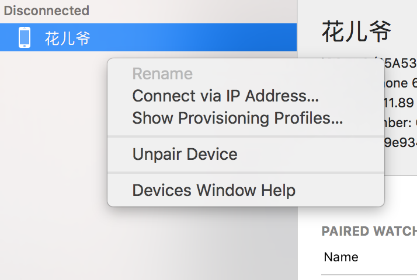
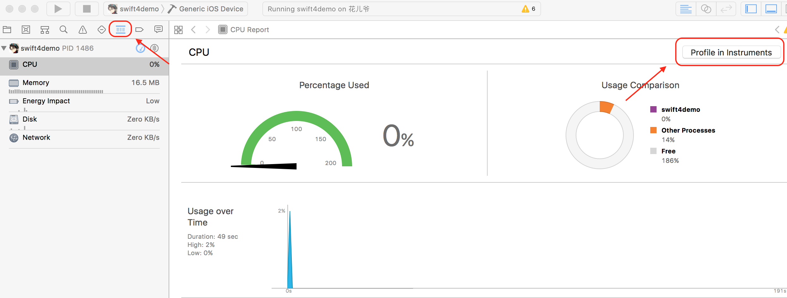

##  Debuging on XCode 9

### 一、 Wireless Development

#### 1.1 无线开发的使用者

1. 增强现实， 虚拟现实， 及相机应用程序的开发者
2. 运动感知和健身应用程序的开发者
3.  AppleTV游戏及应用程序的开发者

#### 1.2 设备配对和工作流（AppleTV连接方式不同）

1. 使用数据线连接设备
2. connect via network

> 通过以上方式，多数家庭和小企业网络无需配置即可连接调试设备；

若无法连接（比如公司内的企业网络）则继续以下步骤：

3. 直接使用IP地址连接，如下图所示

> 在设备熄屏状态下，XCodeDevice管理页面会显示调试设备未连接状态，不用关心，直接调试会直接再次连接到该设备，只要设备还在同一个网段内

#### 1.2 Attach

- attach to precess

- attach to precess by pid or name

#### 1.3 Directly Instrument

#### 1.4 BreakPoint

编辑断点时，会有代码完成提示，比之前更加方便了

### 二、游戏相关控件调试

略
