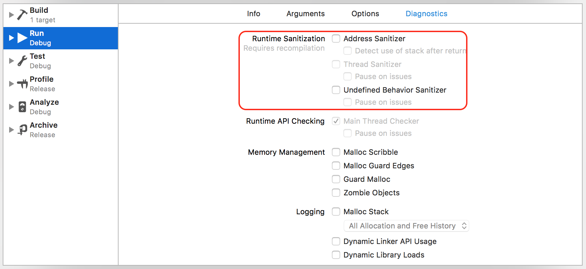

##  Finding Bugs using XCode Run Tools

### 一、运行时完整性检查

- 主线程检查器：1.02X negligible
- 内存检查器（buffer overflow, use-after-free, double free, user after end of scope）1.2X negligible
- 线程检查器（对集合类的竞态访问, data race）2-3X 2X
- 未定论行为检查器（misaligned pointer, null pointer dereference, integer overflow, type mismatch, and more[15+]）5-10X 4

如下图所示：

#### 1.1 主线程检查器

UI Update：UIKit, AppKit, and WebKit

Language: Swift and C languages

> 不需要重新编译，默认开启，调试时即可他用；终于可以享受Android的调试方式了；但是有个缺点，无法调试App启动时运行的代码，这是因为Attach到一个Process需要时间的；

#### 1.2 内存检查器

内存问题会引起严重的安全性Bug，比如：

- 使用'未初始化的对象(use uninitailized obj)'
- 使用'已经被释放的对象（use-after- free）'
- '缓冲区溢出（buffer overflow）'

这些问题是难以重现的Bug；

内存检查器可以探测以下问题：

- use-after-scope
- use-after-return

#### 1.3 线程检查器

跨线程对竞态资源的访问，尽管没有表现出来(原文：even they did not manifest)；

#### 1.4 未定义行为检查器

- 上溢和下溢：Int_Max + 1 ≯ Int_Max ???
- 违反动态类型转换规则

在Build Settings中设置'Apple LLVM 9.0 - Undefined Behavior Sanitizer'开启OPT选项；

> 总结I：以上新特性，在没有引入之前并没有感觉到有多棘手，举的栗子都是些基本的常识问题，感觉像是初学者的福音，并且这些检查器不能同时使用；

> 总结II：使用Swift更加安全，但并不是没有未定义的行为发生，只是相对少了许多而已；
