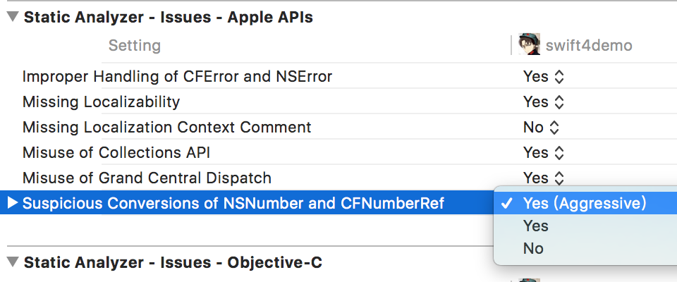

## What's New in LLVM

### 一、系统版本检查和判定

#### 1.1 @available(*, *)

现在可以在Objective-C中使用了

```
if (@available(iOS 11， *)) {
	r = [SomeClass new];
	// do some thing
}
else {
	// fall back when api not available
}

```

#### 1.2 API_AVAILABLITY()

指定自定义类的成员方法可以调用的系统版本号

```
@interfacke MyViewController: UIViewController

- (void) doSomeThing API_AVAILABLITY(ios(11));

@end
```

应用到整个类

```
API_AVAILABLITY(ios(11))
@interfacke MyViewController: UIViewController

- (void) doSomeThing;

@end
```

在C\C++中，有效性检查：

使用`__builtin_availabe`运行时检查，或者：

```
#include <os/availability.h>

void myFunctionForiOS11OrNewer(int i) API_AVAILABLITY(ios(11.0), macos(10.13));
```

### 二、Comparation(静态代码分析)

#### 2.1 object vs scalars

```
@property NSNumber *faceCount;

- (void) identifyFaces 
{
	// boolean
	if (self.faceCount) {
		return
	}
	
	// scalars
	if (self.faceCount > 0) {
		return;
	}
	
	// do some thing
}

```

BuildSettings设置如下：



```

- (void)validate:(NSData *)data error:(NSError * __strong *)error
{
	[Validater check:data finish:^(BOOL success) {
		if (!success) {
			if (error) {
				*error = [[[NSError errorWithDomain:……] retain] autorelease];
			}
		}
	}];
}


```